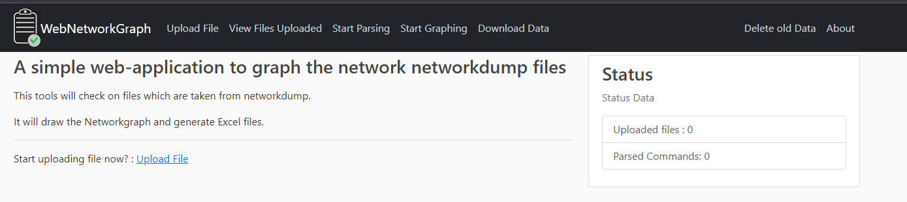
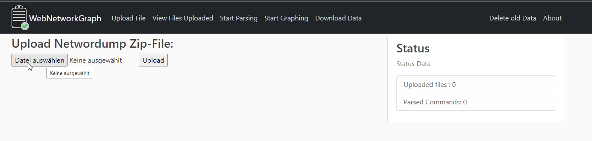
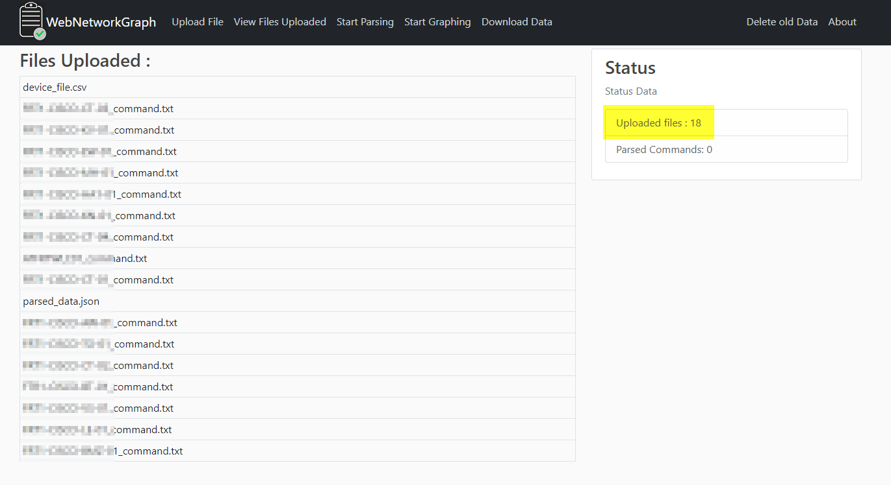
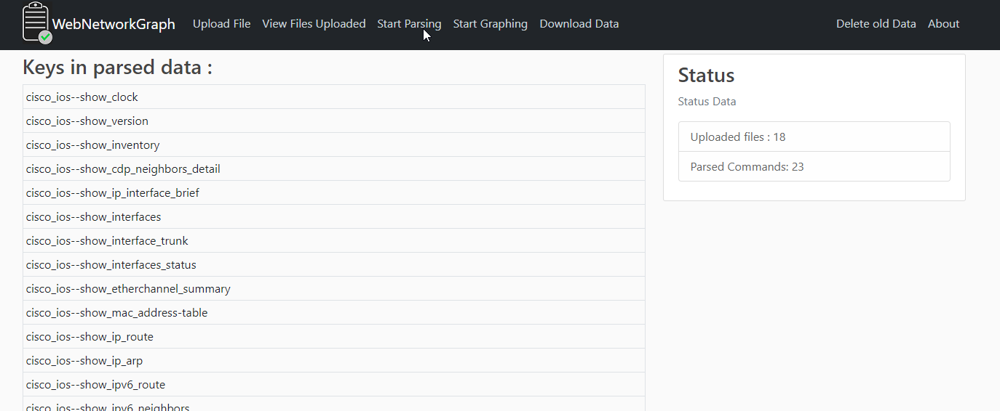
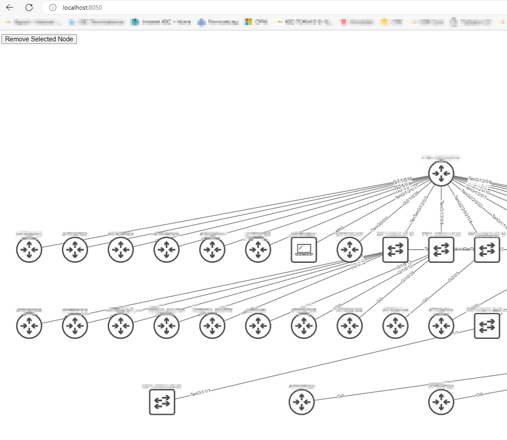
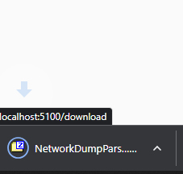
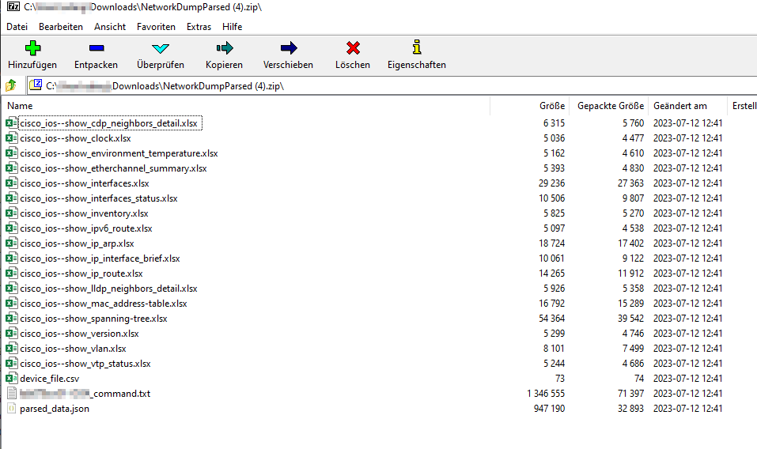

# WebNetworkGraph
This is an extension for WebNetworkDump.

Here you can Upload networkdump.zip files which were created with webnetworkdump : see: https://github.com/edergernot/webnetworkdump1.1 

I tested with Cisco IOS, IOS-XE, NX-OS, HP-Comware and Paloalto Firewalls.

## Easystart with DockerContainer on local maschine!

- Get Container from Dockerhub
  - ```docker run -p 5100:5100 -p 8050:8050 edergernot/webnetworkgraph```

- Start analycing the networkdump.zip file: 
  - ```http://localhost:5100```

Just upload the zip-file, parse it, graph it and download the parsed files.

Note: For graphing it just uses CDP-Data from Cisco-IOS Devices. This will change soon


## Working with webnetworkdump

Index


Upload


View Files


Parse


Graph: If it do not open in a new Browserwindow go to http://localhost:8050


Download


Dumpfile
