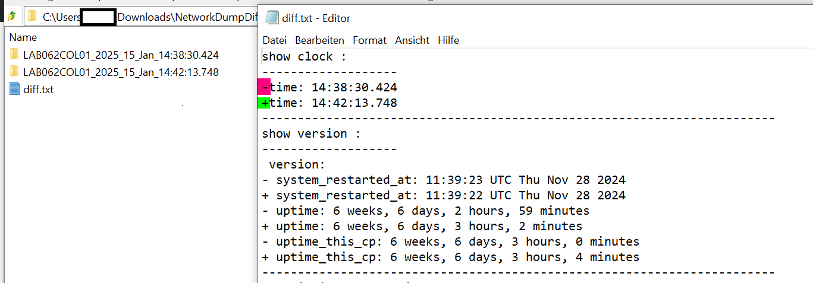

# WebNetworkGraph
This is an extension for WebNetworkDump.<br>
Because of using PyATS for Diff it will nor run on Windows! Jou have to run it on WSL or Linux!

Here you can Upload networkdump.zip files which were created with webnetworkdump : see: https://github.com/edergernot/webnetworkdump1.1 

I tested with Cisco IOS, IOS-XE, NX-OS, HP-Comware and Paloalto Firewalls.


## Easystart with DockerContainer on local maschine!

- Get Container from Dockerhub
  - ```docker run -p 5100:5100 -p 8050:8050 edergernot/webnetworkgraph```

- Start analycing the networkdump.zip file: 
  - ```http://localhost:5100```

Just upload the zip-file, parse it, graph it and download the parsed files.

Note: For graphing it just uses CDP-Data from Cisco-IOS Devices. This will change soon


## Working with webnetworkdump

Index


Upload


View Files


Parse


Graph: If it do not open in a new Browserwindow go to http://localhost:8050


Download


Dumpfile


## Diff 2 Dumpfiles:
Dumpfiles will parsed with PyATS and a diff of the parsed JSON - Data is done!

Select Diff 2 Files and Choose NetworkDump.zip Files, Upload Button will start diff-Process


Diff is running:


Diff-File will automaticly download when finished:


In Diff-Zipfile there is a Folder for every Device:


In every Device-Folder is the "diff.txt" file as well as a Folder with parsed JSON Data from uploaded Dump-File.
The diff.txt is in Linux diff style + - 


Diff ignored counters for interfaces and age for CDP etc.

## Run direct on Host
Windows is not supported because of PyATS (Python Version < 3.12). You have to use WSL or Linux!<br>
Clone the Repo:

```git clone https://github.com/edergernot/WebNetworkgraph```

For getting VendorCodes with the Mac-Tables create a .env file where the API-Key for the Mac-Vendorcode-API ist stored, like this. <br>
You can get it here: https://maclookup.app/api-v2/documentation

```MAC_IOU_API_KEY=abcdefghijklmnopqrstuvwxyz0123456789```

Install the Requirements

```pip install -r requirements.txt```

Run the App:

```python3 webNetworkgraph.py```

Browse the Webinterface:
http://localhost:5100